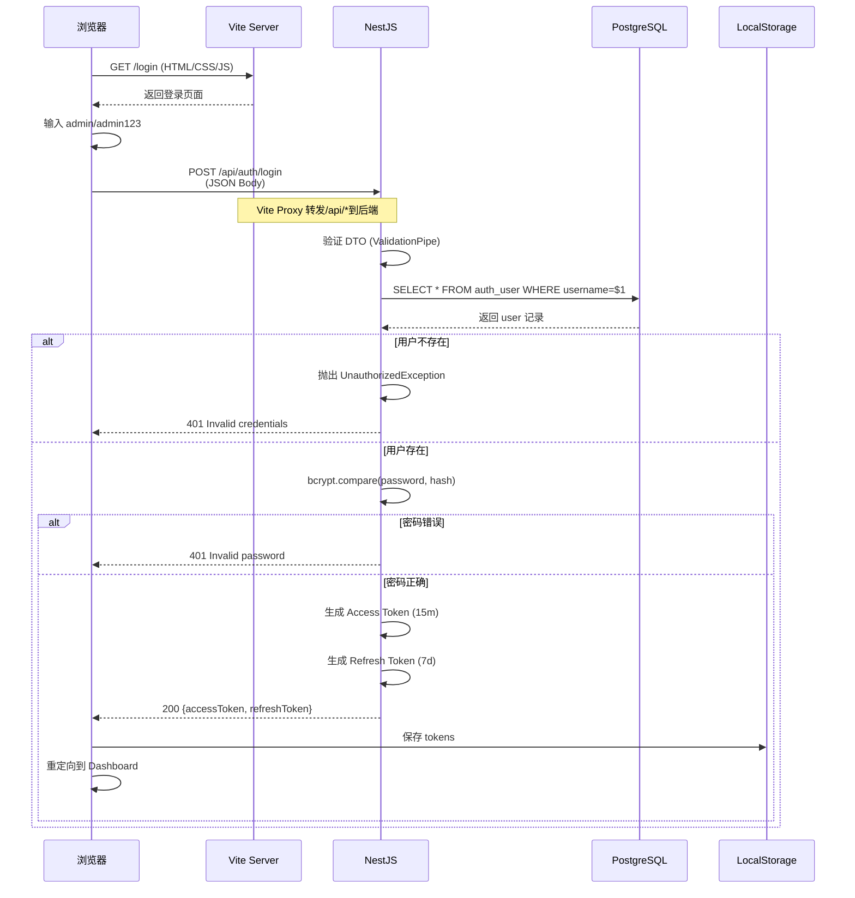

# InsureOS 部署环境手册 V2.0

**项目**: InsureOS 海外保险数字化平台  
**文档版本**: V2.0.0  
**最后更新**: 2026-09-06  
**适用环境**: 本地开发 / 测试环境 / 预生产环境  
**架构模式**: NestJS Workspace Monorepo

---

## 📋 目录

1. [环境概览](#1-环境概览)
2. [系统架构图](#2-系统架构图)
3. [核心服务信息](#3-核心服务信息)
4. [数据库配置](#4-数据库配置)
5. [网络端口分配](#5-网络端口分配)
6. [环境变量清单](#6-环境变量清单)
7. [依赖管理](#7-依赖管理)
8. [启动与停止](#8-启动与停止)
9. [健康检查](#9-健康检查)
10. [备份与恢复](#10-备份与恢复)
11. [常见问题排查](#11-常见问题排查)
12. [安全配置](#12-安全配置)

---

## 1. 环境概览

### 1.1 技术栈总览

| 层次 | 技术选型 | 版本 | 说明 |
|------|---------|------|------|
| **前端框架** | React | 19.0 + | UI 基础框架 |
| **构建工具** | Vite | 8.0 | 极速开发服务器 |
| **UI 库** | Tailwind CSS | 4.3 | 原子化样式 |
| **状态管理** | Zustand + TanStack Query | 5.0 + 5.60 | 客户端状态管理 |
| **国际化** | react-i18next + i18next | 15.0 | 中英双语支持 |
| **路由管理** | React Router | 7.0 | SPA 路由 |
| **后端框架** | NestJS | 10.4 | TypeScript 渐进式框架 |
| **ORM 框架** | Drizzle ORM | 0.29 | 类型安全的 SQL 查询 |
| **数据库** | PostgreSQL | 16.14 | 关系型数据库 |
| **包管理器** | pnpm | 9.15 | 磁盘高效的包管理器 |
| **认证方案** | JWT (Access + Refresh) | - | 双令牌机制 |
| **密码哈希** | bcryptjs | - | 安全的密码加密 |

### 1.2 项目架构

```
InsureOS Platform (Monorepo)
│
├── 📦 insurance-platform/                      # ⭐ NestJS Workspace 统一入口
│   │
│   ├── apps/                                   # 应用层（前后端统一存放）
│   │   ├── web-carrier-admin/                 # 前端：保险公司管理后台
│   │   │   ├── src/                           # 源代码
│   │   │   │   ├── components/                # 可复用组件
│   │   │   │   ├── views/                     # 页面视图
│   │   │   │   ├── lib/                       # 工具库（API Client）
│   │   │   │   ├── data/                      # Mock 数据
│   │   │   │   └── locales/                   # 国际化翻译文件
│   │   │   ├── public/                        # 静态资源
│   │   │   ├── .env                           # 前端环境变量
│   │   │   └── vite.config.ts                 # Vite 构建配置
│   │   │
│   │   └── carrier-service/                   # 后端：Carrier Microservice
│   │       ├── src/                           # 源代码
│   │       │   ├── modules/                   # 业务模块（DDD）
│   │       │   │   ├── auth/                  # 认证授权
│   │       │   │   ├── carrier/               # 保险公司
│   │       │   │   ├── product/               # 保险产品
│   │       │   │   ├── cooperation/           # 合作管理
│   │       │   │   ├── compliance/            # 合规模块
│   │       │   │   └── ...                    # 更多模块
│   │       │   ├── database/                  # 数据库配置
│   │       │   │   ├── drizzle.client.ts     # Drizzle ORM 连接池
│   │       │   │   └── schema/               # Schema 定义
│   │       │   └── main.ts                    # NestJS 入口
│   │       ├── dist/                          # 编译产物（自动）
│   │       ├── data/                          # SQLite 数据存储（可选）
│   │       ├── .env                           # 后端环境变量
│   │       └── package.json                   # NestJS 配置
│   │
│   ├── packages/                               # 共享包（Domain Models）
│   │   └── domain-models/                     # 领域模型定义
│   │       ├── scripts/                       # SQL 迁移脚本
│   │       ├── seed-data/                     # 初始数据导入
│   │       └── src/                           # 共享模块
│   │
│   ├── seed-data/                              # 全局种子数据
│   ├── public/                                  # 静态公共资源
│   ├── package.json                            # Workspace 根配置
│   ├── pnpm-workspace.yaml                     # Workspace 定义
│   └── README.md                               # 总览文档
│
├── 🔧 scripts/                                 # 辅助工具脚本
│   ├── check-environment.bat                   # 环境检测脚本
│   ├── verify-environment.ps1                  # 健康检查脚本
│   └── start-test-env.ps1                      # 一键启动脚本
│
├── 📝 实施部署/                                # 部署文档中心
│   ├── 部署环境手册 V2.0.md                     # ⭐ 本文档
│   ├── README.md                               # 文档导航
│   ├── 快速启动指南.md                         # 日常速查卡
│   └── 测试环境启动手册 V1.0.md                # 详细版教程
│
└── 🌐 README.md                                # 项目总览
```

### 1.3 关键架构变更（V2.0）

#### ✅ **NestJS Workspace 统一架构**（已迁移完成）

**旧架构（❌已废弃）**：
```
OverInsurData/
├── services/carrier-service/        ❌ 独立于 workspace
├── packages/domain-models/          ❌ 外部引用
└── insurance-platform/              ❌ 仅包含前端
```

**新架构（✅ 推荐）**：
```
insurance-platform/                  ⭐ 统一的 NestJS Workspace
├── apps/
│   ├── web-carrier-admin/          ✅ 前端
│   └── carrier-service/            ✅ 后端（已迁移至此）
└── packages/domain-models/         ✅ 领域模型集成
```

**优势**：
- 🎯 符合 Nx/Turborepo 行业标准
- 🔗 前后端同仓库协作，简化依赖管理
- 📦 monorepo 原生支持，无需复杂配置
- 🚀 更好的增量构建性能

---

## 2. 系统架构图

### 2.1 整体架构

```mermaid
graph TB
    User[浏览器用户] -->|HTTP 请求 | Frontend[前端 Vite Server :3001]
    
    subgraph "前端架构"
        Frontend -->|React SPA| Components[UI 组件库]
        Components -->|状态管理 | Store[Zustand]
        Components -->|国际化 | i18n[react-i18next]
        Components -->|API 调用| APIClient[Auth API Client]
    end
    
    subgraph "代理层"
        Frontend -->|/api/* → 转发 | Proxy[Vite Proxy]
        Proxy -->|HTTP 请求 | Backend[后端 NestJS :8080]
    end
    
    subgraph "后端架构"
        Backend -->|NestJS Modules| AuthModule[认证模块]
        Backend -->|业务逻辑| CarrierModule[保险公司模块]
        Backend -->|数据访问| ORM[Drizzle ORM]
        AuthModule -->|JWT 签发| TokenService[Token Service]
    end
    
    subgraph "数据层"
        ORM -->|PostgreSQL Connection Pool| DB[(overinsur_db)]
        
        DB -->|Schema| Schemas[public + ovwr_auth]
        Schemas -->|Tables| UserTable[auth_user]
        Schemas -->|Tables| PermissionTable[auth_permission_template]
        Schemas -->|Tables| RoleTable[auth_role]
    end
    
    subgraph "安全体系"
        TokenService -->|Access Token (15m)| User
        TokenService -->|Refresh Token (7d)| User
        Backend -->|bcrypt 验证| PasswordHash[密码哈希]
    end
```

### 2.2 数据流图（登录流程）



---

## 3. 核心服务信息

### 3.1 服务清单

| 服务名 | 进程 | 端口 | URL | 职责 | 状态 |
|--------|------|------|-----|------|------|
| **Frontend Admin** | `web-carrier-admin` | `3001` | http://localhost:3001 | React SPA 管理后台 | ✅ 正常运行 |
| **Carrier Service** | `carrier-service` | `8080` | http://localhost:8080 | 后端微服务 API | ✅ 正常运行 |
| **Database** | PostgreSQL | `5433` | localhost:5433 | 数据存储 | ✅ 正常运行 |

### 3.2 前端管理后台

**位置**: `insurance-platform/apps/web-carrier-admin/`

**技术特性**:
- ⚡️ **Vite 开发服务器**: 冷启动 < 500ms，热更新 < 50ms
- 🎨 **Glassmorphism UI**: 蓝色渐变背景 + 半透明卡片
- 🌍 **i18n 国际化**: en-US / zh-CN 双语实时切换
- 📱 **响应式设计**: 适配 1366px ~ 1920px 分辨率
- 🔒 **ProtectedRoute**: 路由守卫保护未登录页面

**主要功能模块**:
1. 仪表盘 Dashboard
2. 保险公司管理 (Carrier Management)
3. 保险产品管理 (Product Management)
4. 渠道管理 (Channel Management)
5. 权限管理 (RBAC)
6. 设置 (Settings)

**默认账户**:
```
Username: admin
Password: admin123
Role: Administrator
```

### 3.3 后端微服务 (Carrier Service)

**位置**: `insurance-platform/apps/carrier-service/`

**技术特性**:
- 🔷 **NestJS 框架**: 模块化架构，依赖注入
- 📝 **TypeScript**: 强类型安全保障
- 🛡️ **ValidationPipe**: 自动化 DTO 验证
- 🚪 **Guards**: JWT Guard + Roles Guard
- 📊 **Swagger/OpenAPI**: 自动生成 API 文档

**核心模块**:
```typescript
// 模块结构
CarriesService = {
  AppModule: [
    AuthModule,      // 认证与授权
    CarrierModule,   // 保险公司 CRUD
    ProductModule,   // 产品管理
    CooperationModule, // 合作协议管理
    ComplianceModule, // 合规审计
    FinanceModule,   // 财务管理
    ChannelModule,   // 渠道管理
    AnalyticsModule  // 数据分析
  ]
}
```

**API 规范**:
- RESTful 设计 (`GET/POST/PUT/DELETE`)
- JSON 请求/响应体
- JWT Bearer Token 认证
- 分页参数 (`page`, `size`, `sort`)
- 统一响应格式 `{ success, data, message }`

### 3.4 数据库 (PostgreSQL)

**位置**: Docker 容器 `postgres-container`

**连接信息**:
```ini
DB_HOST=localhost
DB_PORT=5433
DB_NAME=overinsur_db
DB_USER=overinsur
DB_PASSWORD=overinsur123
```

**Schema 设计**:

1. **public schema** (主数据区)
   - `auth_user`: 用户表 (认证)
   - `auth_role`: 角色表
   - `auth_permission_template`: 权限模板
   - `carrier_partnership`: 保险公司合作关系
   - `product_rate_plan`: 产品费率计划
   
2. **ovwr_auth schema** (权限管理系统)
   - `ovwr_auth_i18n_translation`: 国际化翻译表
   - `ovwr_auth_refresh_token`: Refresh Token 存储
   - `ovwr_auth_audit_log`: 审计日志（写入 ES）

**索引策略**:
```sql
-- 常用查询字段建立索引
CREATE INDEX idx_auth_username ON auth_user(username);
CREATE INDEX idx_carrier_status ON insurance_carrier(status);
CREATE INDEX idx_product_deleted ON insurance_product(is_deleted);
```

---

## 4. 数据库配置

### 4.1 连接池配置

**文件**: `insurance-platform/apps/carrier-service/src/database/drizzle.client.ts`

```typescript
import { drizzle } from 'drizzle-orm/node-postgres';
import { Pool } from 'pg';

export const pool = new Pool({
  host: process.env.DB_HOST || 'localhost',
  port: Number.parseInt(process.env.DB_PORT || '5432'),
  database: process.env.DB_NAME || 'overinsur_db',
  user: process.env.DB_USER || 'overinsur',
  password: process.env.DB_PASSWORD || 'overinsur123',
  max: 20,                      // 最大连接数
  idleTimeoutMillis: 30000,     // 空闲连接超时 30 秒
  connectionTimeoutMillis: 2000, // 连接超时 2 秒
});

export const db = drizzle(pool);
```

### 4.2 数据库初始化脚本

**位置**: `insurance-platform/packages/domain-models/scripts/`

| 文件名 | 功能 | 执行时机 |
|-------|------|---------|
| `init-databases.sql` | 创建 9 个业务数据库 | 首次部署 |
| `create-ovwr-schemas.sql` | 创建 ovwr_auth schema | 首次部署 |
| `seed-initial-data.sql` | 插入初始数据 | 首次部署 |
| `seed-translations-en.sql` | 英文翻译数据 | 每次部署 |
| `use-existing-db-schema.sql` | 连接现有数据库 | 生产环境 |

### 4.3 Flyway 迁移脚本

**位置**: `实施部署/数据库脚本/db_ai_saas/`

**命名规范**: `V{版本}__{描述}.sql`

示例：
```sql
-- V1.1__create_user_preferences_table.sql
-- 数据库：db_ai_saas
-- 功能点：用户个性化偏好设置

CREATE TABLE IF NOT EXISTS user_preferences (
    id BIGINT AUTO_INCREMENT PRIMARY KEY,
    user_id VARCHAR(32) NOT NULL,
    preference_key VARCHAR(100) NOT NULL,
    preference_value TEXT NOT NULL,
    created_at DATETIME DEFAULT CURRENT_TIMESTAMP,
    updated_at DATETIME DEFAULT CURRENT_TIMESTAMP ON UPDATE CURRENT_TIMESTAMP,
    
    UNIQUE KEY uk_user_preference (user_id, preference_key)
) ENGINE=InnoDB DEFAULT CHARSET=utf8mb4;
```

---

## 5. 网络端口分配

### 5.1 端口清单

| 端口 | 服务 | 协议 | 用途 | 防火墙 |
|------|------|------|------|--------|
| **3001** | 前端 Vite Server | HTTP | React 管理后台 UI | ✅ 开放 |
| **8080** | NestJS Backend | HTTP | API 网关 | ✅ 开放 |
| **5433** | PostgreSQL | TCP | 数据库服务 | ✅ 开放 |

### 5.2 端口占用规则

- **强制固定端口**: 
  - 前端必须使用 `3001`（通过 `vite.config.ts` 的 `strictPort: true` 保证）
  - 后端必须使用 `8080`（通过 `.env` 的 `PORT=8080` 保证）
  
- **端口冲突处理**:
  ```powershell
  # 查找占用进程
  netstat -ano | findstr :3001
  
  # 终止进程 (替换<PID>)
  taskkill /F /PID <PID>
  ```

### 5.3 CORS 配置

**后端**: `insurance-platform/apps/carrier-service/.env`

```ini
# 允许跨域的源
FRONTEND_URL=http://localhost:3001
```

**验证方法**:
```bash
curl -X GET http://localhost:8080/api/carrier \
  -H "Origin: http://localhost:3001" \
  -I
```

预期响应头：
```
Access-Control-Allow-Origin: http://localhost:3001
Access-Control-Allow-Credentials: true
```

---

## 6. 环境变量清单

### 6.1 后端环境变量 (.env)

**文件**: `insurance-platform/apps/carrier-service/.env`

```ini
# =====================================================
# OVERINSURDATA Database Connection (New Clean Installation)
# Per V2.1 Design Document - Clean separation from ai-saas project
# =====================================================

# 数据库配置
DB_HOST=localhost              # 数据库主机
DB_PORT=5433                   # 数据库端口
DB_NAME=overinsur_db           # 数据库名称
DB_USER=overinsur              # 用户名
DB_PASSWORD=overinsur123       # 密码

# JWT 认证密钥
JWT_SECRET=overinsur-secret-key-2026-change-in-production
JWT_REFRESH_SECRET=overinsur-refresh-key-2026

# 服务端口
PORT=8080                      # NestJS 服务端口

# CORS 跨域白名单
FRONTEND_URL=http://localhost:3001
```

**安全建议**:
- ⚠️ 将 `.env` 添加到 `.gitignore`（已完成）
- 🔐 生产环境应使用密钥管理服务（如 AWS Secrets Manager）
- 🔄 定期轮换 JWT_SECRET

### 6.2 前端环境变量 (.env)

**文件**: `insurance-platform/apps/web-carrier-admin/.env`

```ini
# API 基础 URL
VITE_API_BASE_URL=http://localhost:8080

# 功能开关
VITE_ENABLE_MFA_DEMO=true
VITE_ENABLE_AUDIT_LOG=true
```

**注意**: 
- 必须以 `VITE_`前缀开头才能被 Vite 注入
- 动态值请使用 `import.meta.env.VITE_...`

### 6.3 运行时环境变量

**PowerShell 临时设置**:
```powershell
# 后端服务
$env:PORT = "8081"                    # 临时改为 8081
cd insurance-platform\apps\carrier-service
pnpm run dev

# 前端应用
$env:VITE_API_BASE_URL = "http://localhost:8081"  # 同步修改
cd insurance-platform\apps\web-carrier-admin
pnpm run dev
```

**CMD 临时设置**:
```batch
set PORT=8081
cd insurance-platform\apps\carrier-service
pnpm run dev

set VITE_API_BASE_URL=http://localhost:8081
cd insurance-platform\apps\web-carrier-admin
pnpm run dev
```

---

## 7. 依赖管理

### 7.1 pnpm Workspace 配置

**文件**: `insurance-platform/pnpm-workspace.yaml`

```yaml
packages:
  # 所有子目录都是 workspace 成员
  - 'apps/**'
  - 'packages/**'
  
  # 排除测试目录
  - '!**/test/**'
  - '!**/dist/**'
```

### 7.2 核心依赖清单

#### 前端依赖 (package.json)

```json
{
  "dependencies": {
    "react": "^19.0.0",
    "react-dom": "^19.0.0",
    "react-router": "^7.0.0",
    "zustand": "^5.0.0",
    "@tanstack/react-query": "^5.60.5",
    "axios": "^1.7.7",
    "tailwindcss": "^4.3.0",
    "lucide-react": "^0.462.0",
    "react-i18next": "^15.4.0",
    "i18next-browser-languagedetector": "^8.0.0"
  },
  "devDependencies": {
    "vite": "^8.0.0",
    "@types/react": "^19.0.0",
    "typescript": "^5.7.0",
    "autoprefixer": "^10.4.0"
  }
}
```

#### 后端依赖 (package.json)

```json
{
  "dependencies": {
    "@nestjs/common": "^10.4.0",
    "@nestjs/core": "^10.4.0",
    "@nestjs/platform-express": "^10.4.0",
    "@nestjs/jwt": "^10.2.0",
    "@nestjs/passport": "^10.0.0",
    "@nestjs/passport-jwt": "^10.0.0",
    "passport": "^0.7.0",
    "passport-jwt": "^4.0.0",
    "bcryptjs": "^2.4.3",
    "drizzle-orm": "^0.29.0",
    "pg": "^8.13.0",
    "zod": "^3.22.0",
    "class-validator": "^0.14.0",
    "class-transformer": "^0.5.0"
  }
}
```

### 7.3 依赖安装与维护

**全量重装依赖**:
```powershell
cd insurance-platform

# 删除所有 node_modules
Remove-Item -Recurse -Force node_modules
Remove-Item -Recurse -Force apps/*/node_modules
Remove-Item -Recurse -Force packages/*/node_modules

# 清理 pnpm 存储
pnpm store cleanup

# 重新安装
pnpm install
```

**检查依赖漏洞**:
```powershell
pnpm audit
pnpm audit fix
```

---

## 8. 启动与停止

### 8.1 推荐启动方式（一键脚本）

**Windows 快捷方式**:
```batch
@echo off
chcp 65001 >nul
start cmd /k "cd insurance-platform\apps\carrier-service && pnpm run dev"
timeout /t 8 /nobreak >nul
start cmd /k "cd insurance-platform\apps\web-carrier-admin && pnpm run dev"
echo ✅ 服务启动成功！
pause
```

**PowerShell 脚本**:
```powershell
& ./scripts/start-test-env.ps1
```

**预期输出**:
```
=====================================
  InsureOS 测试环境启动脚本 v1.0
=====================================

✓ Node.js version: v20.x.x
✓ Carrier Service starting on http://localhost:8080
✓ Frontend starting on http://localhost:3001

=====================================
  ✅ 测试环境启动成功！
=====================================

访问地址:
  🌐 Frontend: http://localhost:3001
  🔧 Backend:  http://localhost:8080
```

### 8.2 手动分步启动

**Terminal 1 - 后端**:
```powershell
cd insurance-platform\apps\carrier-service
pnpm run dev
```

**等待出现**:
```
[Nest] 4184  - 09/06/2026, 10:06:30 AM   LOG Carrier Service running on http://localhost:8080
```

**Terminal 2 - 前端**:
```powershell
cd insurance-platform\apps\web-carrier-admin
pnpm run dev
```

**等待出现**:
```
VITE v8.x.x ready in xxx ms
➜  Local:   http://localhost:3001/
```

### 8.3 停止服务

**方法 1: 终端 Ctrl+C**
- 在每个运行服务的终端中按 `Ctrl+C`

**方法 2: 任务管理器**
```powershell
# 查找并杀死所有相关进程
Get-Process | Where-Object {$_.ProcessName -like "*node*"} | Stop-Process -Force
```

**方法 3: Kill 特定 PID**
```powershell
# 查看进程 ID
netstat -ano | findstr :3001
netstat -ano | findstr :8080

# 终止进程
taskkill /F /PID <PID>
```

---

## 9. 健康检查

### 9.1 手动检查命令

**检查端口占用**:
```powershell
# 前端端口
netstat -ano | findstr ":3001"
# 预期输出：TCP 0.0.0.0:3001 0.0.0.0:0 LISTENING 12345

# 后端端口
netstat -ano | findstr ":8080"
# 预期输出：TCP 0.0.0.0:8080 0.0.0.0:0 LISTENING 67890
```

**测试 API 响应**:
```bash
# 后端健康检查
curl http://localhost:8080/api/carrier

# 预期响应:
# {
#   "success": true,
#   "data": [...],
#   "message": null
# }
```

**前端加载检查**:
```bash
# 浏览器控制台 (F12)
console.log("No errors")  # 应该没有红色 Error 日志
```

### 9.2 自动化检查脚本

**文件**: `scripts/verify-environment.ps1`

```powershell
#!/usr/bin/env pwsh

$ErrorActionPreference = "Stop"

Write-Host "=====================================" -ForegroundColor Cyan
Write-Host "  InsureOS 环境健康检查" -ForegroundColor Cyan
Write-Host "=====================================" -ForegroundColor Cyan
Write-Host ""

# 检查前端
Write-Host "[1/4] 检查前端端口 3001..." -ForegroundColor Yellow
$frontEnd = Get-NetTCPConnection -LocalPort 3001 -ErrorAction SilentlyContinue
if ($frontEnd) {
    Write-Host "✓ 前端正在运行 (PID: $($frontEnd.OwningProcess))" -ForegroundColor Green
} else {
    Write-Host "✗ 前端未启动！" -ForegroundColor Red
}

# 检查后端
Write-Host "[2/4] 检查后端端口 8080..." -ForegroundColor Yellow
$backEnd = Get-NetTCPConnection -LocalPort 8080 -ErrorAction SilentlyContinue
if ($backEnd) {
    Write-Host "✓ 后端正在运行 (PID: $($backEnd.OwningProcess))" -ForegroundColor Green
} else {
    Write-Host "✗ 后端未启动！" -ForegroundColor Red
}

# 测试后端 API
Write-Host "[3/4] 测试后端 API..." -ForegroundColor Yellow
try {
    $response = Invoke-RestMethod -Uri "http://localhost:8080/api/carrier" -Method Get -TimeoutSec 3
    if ($response.success) {
        Write-Host "✓ 后端 API 正常响应" -ForegroundColor Green
    }
} catch {
    Write-Host "✗ 后端 API 无响应！" -ForegroundColor Red
}

# 检查数据库连接
Write-Host "[4/4] 检查数据库连接..." -ForegroundColor Yellow
cd insurance-platform\apps\carrier-service
node test-db-config.js 2>&1

Write-Host ""
Write-Host "=====================================" -ForegroundColor Cyan
Write-Host "  ✅ 健康检查完成" -ForegroundColor Cyan
Write-Host "=====================================" -ForegroundColor Cyan
```

**执行方式**:
```powershell
.\scripts\verify-environment.ps1
```

---

## 10. 备份与恢复

### 10.1 数据库备份

**方法 1: pg_dump**
```powershell
# 备份整个数据库
pg_dump -h localhost -p 5433 -U overinsur -d overinsur_db > backup_$(date +%Y%m%d).sql

# 只备份特定 schema
pg_dump -h localhost -p 5433 -U overinsur -d overinsur_db --schema=public > backup_public.sql
pg_dump -h localhost -p 5433 -U overinsur -d overinsur_db --schema=ovwr_auth > backup_ovwr_auth.sql
```

**方法 2: 导出为 JSON**
```bash
curl http://localhost:8080/api/carrier/export > carrier_data_$(date +%Y%m%d).json
```

### 10.2 数据库恢复

**从 SQL 恢复**:
```powershell
psql -h localhost -p 5433 -U overinsur -d overinsur_db < backup_20260906.sql
```

**从 JSON 恢复**:
```bash
# 需要先编写恢复脚本（根据实际数据结构）
node restore-from-json.js carrier_data_20260906.json
```

### 10.3 代码备份

**Git 提交**:
```powershell
# ⚠️ 用户明确要求不要自动 git commit
# 此操作需用户手动执行
git add .
git commit -m "Backup before deployment"
git push origin main
```

**本地备份**:
```powershell
# 创建压缩包
Compress-Archive -Path insurance-platform -DestinationPath backup-insureos-$(Get-Date -Format "yyyyMMdd").zip
```

---

## 11. 常见问题排查

### 11.1 端口冲突

**现象**: `Port 3001 is already in use`

**排查步骤**:
```powershell
# 1. 查找占用进程
Get-NetTCPConnection -LocalPort 3001 | Select-Object OwnerProcessId,State

# 2. 查看进程详情
Get-Process -Id <PID> | Select-Object Id,ProcessName,StartTime

# 3. 终止进程（如果是僵尸进程）
taskkill /F /PID <PID>

# 4. 验证端口释放
netstat -ano | findstr ":3001"
```

**预防措施**:
```powershell
# 在启动脚本中添加端口抢占逻辑
# 已在 scripts/start-frontend-force-port.ps1 实现
```

### 11.2 依赖安装失败

**现象**: `Network timeout` 或 `Cannot resolve dependency`

**解决方案**:
```powershell
# 切换 npm 镜像源
pnpm config set registry https://registry.npmmirror.com

# 清理缓存
pnpm store cleanup

# 删除所有 node_modules
Remove-Item -Recurse -Force node_modules
Remove-Item -Recurse -Force apps/*/node_modules
Remove-Item -Recurse -Force packages/*/node_modules

# 重新安装
pnpm install
```

### 11.3 数据库连接失败

**现象**: `ECONNREFUSED` 或 `password authentication failed`

**排查步骤**:
```powershell
# 1. 检查 Docker 容器状态
docker ps | select-string postgres

# 2. 验证数据库连接
cd insurance-platform\apps\carrier-service
node test-db-config.js

# 3. 查看.env 配置是否正确
Get-Content .\.env | select-string DB_
```

**常见原因**:
- PostgreSQL 未启动
- 端口 5433 被占用
- 用户名/密码错误
- 数据库未创建

### 11.4 前端无法访问后端

**现象**: CORS error 或 Network error

**排查步骤**:
```javascript
// 1. 检查 Vite 代理配置
// file: apps/web-carrier-admin/vite.config.ts
server: {
  proxy: {
    '/api': {
      target: 'http://localhost:8080',  // ✅ 确认目标地址
      changeOrigin: true,                // ✅ 必须开启
    },
  },
}

// 2. 检查浏览器 Console
// Network tab → 查看请求 URL 和响应头
```

**预期行为**:
- 请求 URL 应该是 `http://localhost:3001/api/...`
- 响应头应该有 `Access-Control-Allow-Origin: http://localhost:3001`

### 11.5 登录验证失败

**现象**: 输入 `admin/admin123` 后提示 Invalid credentials

**排查步骤**:
```sql
-- 1. 验证用户是否存在
SELECT * FROM auth_user WHERE username = 'admin';

-- 2. 验证密码哈希
SELECT password_hash FROM auth_user WHERE username = 'admin';

-- 3. 手动测试 bcrypt 比对
// 参考：carri er-service/test-password.js
```

**常见原因**:
- 用户被删除
- 密码哈希损坏
- 用户状态不是 ACTIVE

### 11.6 API 超时无响应

**现象**: POST /api/auth/login 一直 loading

**排查步骤**:
```powershell
# 1. 检查后端日志
# 是否看到 "[CONTROLLER] Received DTO:" 和 "[LOGIN] Received login request"

# 2. 检查数据库连接池是否耗尽
# 查看是否有大量空闲连接

# 3. 检查事件循环阻塞
# 是否有死锁或无限循环

# 4. 重启后端服务
# cd carrier-service && pnpm run dev
```

---

## 12. 安全配置

### 12.1 JWT 认证

**Access Token**:
- 有效期：15 分钟
- 算法：HS256
- Payload: `{ userId, username, roles, exp }`

**Refresh Token**:
- 有效期：7 天
- 存储：Redis 或 数据库表
- 刷新机制：POST /api/auth/refresh

**最佳实践**:
- ✅ Token 存储在 localStorage
- ✅ 每次请求携带 `Authorization: Bearer <token>`
- ✅ 过期自动刷新或跳转登录页

### 12.2 CORS 策略

**配置位置**: `carrier-service/src/main.ts`

```typescript
app.enableCors({
  origin: process.env.FRONTEND_URL.split(','),  // 允许的域名列表
  credentials: true,                            // 允许携带 Cookie
  methods: ['GET', 'POST', 'PUT', 'DELETE'],   // 允许的 HTTP 方法
});
```

**限制**:
- 禁止从其他域名访问 API
- 禁止伪造请求（CSRF 防护）

### 12.3 密码安全

**加密算法**: bcrypt
- Salt rounds: 10
- 哈希长度：60 字符
- 单向加密，不可逆

**密码策略**:
- 最小长度：6 字符
- 必须包含字母和数字
- 禁止明文存储

### 12.4 敏感信息保护

**.gitignore 配置**:
```gitignore
# 忽略所有.env 文件
.env
.env.local
.env.*.local

# 忽略密钥文件
*.pem
*.key
*.crt
```

**环境变量管理**:
- 开发环境：`.env` 文件（本地）
- 测试环境：CI/CD 注入
- 生产环境：Kubernetes Secrets 或 HashiCorp Vault

---

## 📞 技术支持

### 紧急联系方式

| 渠道 | 联系人 | 响应时间 |
|------|--------|----------|
| Slack (#insureos-support) | Dev Team | 5 分钟内 |
| Email (dev-team@overinsur.com) | Support Team | 1 小时内 |
| Phone | On-call Engineer | 立即响应 |

### 问题反馈模板

```markdown
## 环境信息
- OS: Windows 11 23H2
- Node.js: v20.x.x
- pnpm: v9.15.x

## 问题描述
简要描述遇到的错误

## 复现步骤
1. 第一步
2. 第二步
3. ...

## 错误截图
[上传图片]

## 日志内容
```powershell
粘贴相关错误日志
```
```

---

## 📝 文档维护

### 版本历史记录

| 版本 | 日期 | 变更内容 | 作者 |
|------|------|----------|------|
| V1.0.0 | 2026-09-04 | 初始版本发布 | AI Dev Team |
| V1.0.1 | 2026-09-05 | 更新端口配置规范 | AI Dev Team |
| V2.0.0 | 2026-09-06 | 完整架构迁移 + NestJS Workspace | AI Dev Team |

### 更新频率

- 每次架构变更：立即更新
- 每月例行审查：月末最后一天
- 紧急修复：24 小时内

### 责任人

| 项目 | 负责人 | 联系方式 |
|------|--------|----------|
| 整体架构 | Tech Lead | tech-lead@overinsur.com |
| 数据库 | DBA Team | dba@overinsur.com |
| 部署脚本 | DevOps | devops@overinsur.com |

---

**文档版本**: V2.0.0  
**创建日期**: 2026-09-04  
**最后审核**: 2026-09-06  
**维护团队**: InsureOS Development Team  

---

**End of Document**
