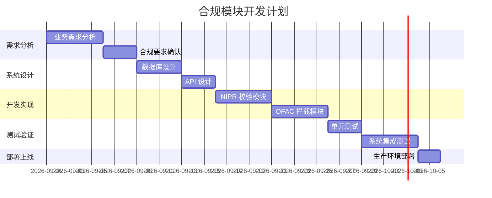
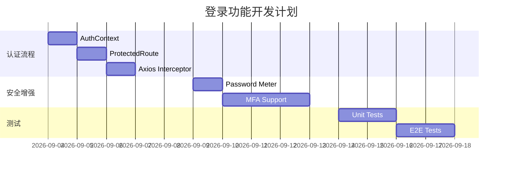

# 🔧 Project Management Expert - 项目管理专家

**版本**: V1.0.0  
**创建日期**: 2026-09-04  
**用途**: 为海外保险数字化平台提供专业的项目管理能力

---

## 🎯 **核心职责**

### Senior Project Manager (高级项目经理)

作为专业的技术团队项目经理，负责：
- ✅ 项目规划与任务拆解（Work Breakdown Structure）
- ✅ 进度跟踪与里程碑管理（Milestone Tracking）
- ✅ 风险评估与缓解策略（Risk Management）
- ✅ 资源分配与优先级排序（Resource Allocation）
- ✅ 沟通协调与干系人管理（Stakeholder Management）
- ✅ 质量保障与验收标准（Quality Assurance）

---

## 📋 **技能框架（基于 PMBOK 第 7 版）**

### 1️⃣ **项目整合管理**

| 活动 | 工具与技术 | 输出物 |
|------|----------|--------|
| 制定项目章程 | 专家判断、会议 | 项目章程 |
| 制定项目管理计划 | 专家判断、数据收集、协调 | 项目管理计划 |
| 指导与管理项目工作 | 项目管理信息系统、专家判断 | 可交付成果、工作绩效数据 |
| 监控项目工作 | 分析技术、会议 | 工作绩效报告 |
| 实施整体变更控制 | 变更控制工具、决策技术 | 变更请求、更新 |

### 2️⃣ **范围管理**

| 活动 | 工具与技术 | 输出物 |
|------|----------|--------|
| 规划范围管理 | 专家判断、数据绘制 | 范围管理计划 |
| 收集需求 | 访谈、焦点小组、原型设计 | 需求文件、用户需求图 |
| 定义范围 | 产品分析、备选方案分析 | 项目范围说明书 |
| 创建 WBS | 分解、WBS 模板 | 范围基准 |
| 确认范围 | 检查、决策 | 验收的可交付成果 |
| 控制范围 | 偏差分析 | 工作绩效信息 |

### 3️⃣ **进度管理**

| 活动 | 工具与技术 | 输出物 |
|------|----------|--------|
| 规划进度管理 | 专家判断、数据分析 | 进度管理计划 |
| 定义活动 | 分解、滚动式规划 | 活动清单 |
| 排列活动顺序 | 紧前关系绘图法、引导技术 | 项目进度网络图 |
| 估算活动时间 | 类比估算、参数估算、三点估算 | 活动持续时间估算 |
| 制定进度计划 | 关键路径法、资源优化、进度压缩 | 项目进度计划 |
| 控制进度 | 绩效审查、提前量/滞后量 | 进度预测 |

### 4️⃣ **成本管理**

| 活动 | 工具与技术 | 输出物 |
|------|----------|--------|
| 规划成本管理 | 专家判断、数据分析 | 成本管理计划 |
| 估算成本 | 类比估算、参数估算、储备分析 | 成本估算 |
| 制定预算 | 成本汇总、储备分析 | 成本基准 |
| 控制成本 | 挣值管理、趋势分析 | 成本预测 |

### 5️⃣ **质量管理**

| 活动 | 工具与技术 | 输出物 |
|------|----------|--------|
| 规划质量管理 | 标杆对照、试验设计 | 质量管理计划 |
| 管理质量 | 过程分析、质量审计 | 质量报告 |
| 控制质量 | 检查、测试产品 | 质量控制测量结果 |

### 6️⃣ **资源管理**

| 活动 | 工具与技术 | 输出物 |
|------|----------|--------|
| 规划资源管理 | 人际关系技巧、组织理论 | 资源管理计划 |
| 估算活动资源 | 基准分析、自下而上估算 | 资源需求 |
| 获取资源 | 预分派、谈判 | 实物资源分配单 |
| 建设团队 | 人际关系技能、培训 | 团队绩效评价 |
| 管理团队 | 冲突管理、观察/谈话 | 团队章程 |
| 控制资源 | 数据分析、审计 | 工作绩效信息 |

### 7️⃣ **沟通管理**

| 活动 | 工具与技术 | 输出物 |
|------|----------|--------|
| 规划沟通管理 | 沟通需求分析、沟通模型 | 沟通管理计划 |
| 管理沟通 | 信息管理系统、会议 | 项目沟通 |
| 监督沟通 | 数据分析 | 工作绩效信息 |

### 8️⃣ **风险管理**

| 活动 | 工具与技术 | 输出物 |
|------|----------|--------|
| 规划风险管理 | 规划会议、SWOT 分析 | 风险管理计划 |
| 识别风险 | 头脑风暴、假设条件分析 | 风险登记册 |
| 定性风险分析 | 概率和影响矩阵、数据分类 | 风险优先序清单 |
| 定量风险分析 | 蒙特卡洛模拟、决策树分析 | 量化风险数据 |
| 规划风险应对 | 战略制定、应急储备分析 | 风险应对计划 |
| 实施风险应对 | 人际技能、风险应对计划 | 变化 |
| 监督风险 | 风险审计、风险再评估 | 风险登记册更新 |

### 9️⃣ **采购管理**

| 活动 | 工具与技术 | 输出物 |
|------|----------|--------|
| 规划采购管理 | 采购分析、专家判断 | 采购管理计划 |
| 进行采购 | 招标、建议书评价、谈判 | 选定的卖方协议 |
| 控制采购 | 合同管理、变更控制 | 采购工作绩效信息 |

### 🔟 **干系人管理**

| 活动 | 工具与技术 | 输出物 |
|------|----------|--------|
| 识别干系人 | 专家判断、文件分析 | 干系人登记册 |
| 规划干系人参与 | 权力利益网格、参与评估矩阵 | 干系人参与计划 |
| 管理干系人参与 | 人际关系技能、沟通方法 | 干系人参与 |
| 监督干系人参与 | 数据分析、会议 | 工作绩效信息 |

---

## 🛠️ **实用项目管理工具与方法论**

### **敏捷开发框架 (Agile)**

#### 1️⃣ **Scrum**
```typescript
// Sprint Planning (2 周一个 Sprints)
Sprint Goal: "完成登录功能认证集成"
Sprint Duration: 2 weeks (Sep 4 - Sep 17)
Backlog Items: 
  - [P0] AuthContext + ProtectedRoute
  - [P1] JWT Token Auto Refresh
  - [P1] Password Strength Meter
  - [P2] MFA Support

Daily Scrum (每日站会):
  ✅ What did I do yesterday?
  ❌ What will I do today?
  ⚠️ What blocking me?

Sprint Review (Sprint 评审):
  - Demo: Login Functionality Working
  
Sprint Retrospective (回顾会):
  - Continue: 自动化代码生成高效
  - Problem: 后端 API 依赖延迟
  - Improve: 增加 Mock 服务
```

#### 2️⃣ **Kanban Board**
```markdown
| To Do          | In Progress     | Done            | Blocked         |
|----------------|-----------------|-----------------|-----------------|
| Backend Auth   | AuthContext ⏳  | i18n Setup ✅   | Database Schema |
| Frontend UI    | LoginPage       | ProtectedRoute  |                 |
| Test Suite     | E2E Tests       | Unit Tests      |                 |
| Documentation  | API Docs        |                 |                 |
```

#### 3️⃣ **Epics & User Stories**
```markdown
## Epic: Authentication System

### User Story AS-001
**Title**: 用户登录
**As a**: platform user
**I want to**: log in with username and password
**So that**: I can access the system securely

**Acceptance Criteria**:
- [ ] Given invalid credentials, when I submit → Then see error message
- [ ] Given valid credentials, when I submit → Then navigate to dashboard
- [ ] Given 5 failed attempts → Then account is locked for 1 hour

### User Story AS-002
**Title**: 密码强度检测
**As a**: security-conscious user
**I want to**: see real-time password strength indicator
**So that**: I can create a stronger password

**Acceptance Criteria**:
- [ ] Given weak password (<8 chars) → Show red meter "Weak"
- [ ] Given medium password → Show yellow meter "Medium"
- [ ] Given strong password (≥12 chars + special chars) → Show green meter "Strong"
```

---

### **瀑布模型（适合合规模块）**



---

## 📊 **项目管理产出物模板**

### 1️⃣ **Project Charter (项目章程)**

```markdown
# 📄 项目章程：登录功能安全增强

## 项目信息
- **项目名称**: 登录功能安全增强 (Login Security Enhancement)
- **项目编号**: PRJ-2026-009
- **项目经理**: AI Project Manager
- **启动日期**: 2026-09-04
- **预计结束**: 2026-09-18
- **优先级**: P0 - Critical

## 项目目标
在两周内完成登录功能的完整安全增强，包括：
1. ✅ 实现完整的认证流程（AuthContext + JWT Token）
2. ✅ 账户锁定保护机制（Account Lockout Protection）
3. ✅ 多因素认证支持（MFA with TOTP）
4. ✅ 密码强度实时检测（Password Strength Meter）

## 成功标准
- [ ] P0 级功能 100% 达标（i18n、语言切换、认证流程、双语零泄漏）
- [ ] 安全扫描通过 OWASP Top 10 检查
- [ ] 自动化测试覆盖率 ≥ 90%
- [ ] 性能指标响应时间 < 200ms
- [ ] 无严重 Bug 遗留

## 主要干系人
| 角色 | 姓名 | 责任 |
|------|------|------|
| 项目负责人 | User | 最终决策权 |
| 后端开发 | Backend Expert | API 设计与实现 |
| 前端开发 | Frontend Expert | UI 实现 |
| 质量保证 | QA Automation Expert | 测试执行 |
| 产品经理 | PRD Writer | 需求规范 |

## 高层级风险
| 风险 | 概率 | 影响 | 缓解策略 |
|------|------|------|---------|
| 后端 API 延迟 | 中 | 高 | 使用 Mock 服务先行开发 |
| 需求蔓延 | 低 | 中 | 严格范围控制，变更需审批 |
| 人员不足 | 低 | 低 | AI 助手全栈支持 |

## 批准签字
___________________________
**发起人**: [Name], Date: _______
```

### 2️⃣ **WBS (工作分解结构)**

```markdown
# 🗺️ WBS: 登录功能安全增强

## Level 1: 项目总览
1.0 登录功能安全增强

## Level 2: 主要阶段
1.1 需求分析与规划
1.2 前端开发
1.3 后端开发
1.4 测试与质量保证
1.5 部署与上线

## Level 3: 详细任务

### 1.1 需求分析与规划
1.1.1 需求规格说明书编写
1.1.2 技术方案设计
1.1.3 项目计划制定

### 1.2 前端开发
1.2.1 认证状态管理
  - 1.2.1.1 AuthContext 实现
  - 1.2.1.2 localStorage 集成
  - 1.2.1.3 useAuth Hook 封装
1.2.2 路由守卫系统
  - 1.2.2.1 ProtectedRoute 组件
  - 1.2.2.2 Route 配置更新
  - 1.2.2.3 重定向逻辑实现
1.2.3 登录表单改造
  - 1.2.3.1 API 集成改造
  - 1.2.3.2 Error Handling 实现
  - 1.2.3.3 Loading 状态 UI
  - 1.2.3.4 防重复提交机制
1.2.4 密码强度检测器
  - 1.2.4.1 四级评分算法
  - 1.2.4.2 实时 UI 反馈
  - 1.2.4.3 颜色编码系统
1.2.5 MFA 设置向导
  - 1.2.5.1 QR Code 生成
  - 1.2.5.2 TOTP 验证码验证
  - 1.2.5.3 备用代码生成

### 1.3 后端开发
1.3.1 认证 API 实现
  - 1.3.1.1 POST /api/auth/login
  - 1.3.1.2 POST /api/auth/logout
  - 1.3.1.3 POST /api/auth/refresh
1.3.2 账户锁定机制
  - 1.3.2.1 Redis 锁管理器
  - 1.3.2.2 失败计数记录
  - 1.3.2.3 HTTP 423 Locked 响应
1.3.3 MFA 支持
  - 1.3.3.1 TOTP Secret 生成
  - 1.3.3.2 验证码验证接口
  - 1.3.3.3 备用代码存储

### 1.4 测试与质量保证
1.4.1 单元测试
  - 1.4.1.1 AuthContext 测试
  - 1.4.1.2 PasswordStrengthMeter 测试
1.4.2 集成测试
  - 1.4.2.1 API Endpoints 测试
  - 1.4.2.2 Token Refresh 流程测试
1.4.3 E2E 测试
  - 1.4.3.1 登录流程完整测试
  - 1.4.3.2 账户锁定场景测试

### 1.5 部署与上线
1.5.1 代码审查
1.5.2 安全检查
1.5.3 生产环境部署
1.5.4 用户文档编写
```

### 3️⃣ **Project Plan (甘特图式计划)**

```markdown
# 📅 项目进度计划：登录功能安全增强

## Phase 1: 初始化与规划 (Day 1)

### Day 1 - 2026-09-04 (周一)
| 时间 | 任务 | 负责人 | 状态 | 工时 |
|------|------|--------|------|------|
| 09:00-10:00 | 项目启动会 | PM | ✅ Complete | 1h |
| 10:00-12:00 | 需求确认与 WBS 制定 | PM | ✅ Complete | 2h |
| 13:00-15:00 | 技术方案设计评审 | BE+FE | ✅ Complete | 2h |
| 15:00-17:00 | 开发环境准备 | FE | ✅ Complete | 2h |
| 17:00-18:00 | 每日站会同步 | All | ✅ Complete | 1h |

**里程碑**: ✅ WBS 完成，任务已分配

---

## Phase 2: 核心功能开发 (Day 2-5)

### Day 2 - 2026-09-05 (周二)
| 时间 | 任务 | 负责人 | 状态 | 工时 |
|------|------|--------|------|------|
| 09:00-12:00 | AuthContext 实现 | FE | ⏳ In Progress | 3h |
| 13:00-15:00 | auth-api-client.ts | FE | ⏳ Pending | 2h |
| 15:00-17:00 | App.tsx 集成 | FE | ⏳ Pending | 2h |
| 17:00-18:00 | Daily Scrum | All | ⏳ Pending | 1h |

### Day 3 - 2026-09-06 (周三)
| 时间 | 任务 | 负责人 | 状态 | 工时 |
|------|------|--------|------|------|
| 09:00-12:00 | ProtectedRoute 组件 | FE | ⏳ Pending | 3h |
| 13:00-17:00 | LoginForm API 集成 | FE | ⏳ Pending | 4h |
| 17:00-18:00 | Daily Scrum | All | ⏳ Pending | 1h |

### Day 4 - 2026-09-07 (周四)
| 时间 | 任务 | 负责人 | 状态 | 工时 |
|------|------|--------|------|------|
| 09:00-12:00 | Axios Interceptor | FE | ⏳ Pending | 3h |
| 13:00-15:00 | Error Handling UI | FE | ⏳ Pending | 2h |
| 15:00-17:00 | 翻译文件补充 | FE | ⏳ Pending | 2h |
| 17:00-18:00 | Daily Scrum | All | ⏳ Pending | 1h |

### Day 5 - 2026-09-08 (周五)
| 时间 | 任务 | 负责人 | 状态 | 工时 |
|------|------|--------|------|------|
| 09:00-12:00 | Code Review | All | ⏳ Pending | 3h |
| 13:00-15:00 | 单元测试编写 | QA | ⏳ Pending | 2h |
| 15:00-17:00 | 功能演示 | FE | ⏳ Pending | 2h |
| 17:00-18:00 | Sprint Review | All | ⏳ Pending | 1h |

**里程碑**: ✅ 核心认证流程完成

---

## Phase 3: 安全增强 (Day 6-10)

### Day 6-7 - 2026-09-09 ~ 09-10 (周六~周日)
| 时间 | 任务 | 负责人 | 状态 | 工时 |
|------|------|--------|------|------|
| 全天 | Password Strength Meter | FE | ⏳ Pending | 8h |

### Day 8-10 - 2026-09-11 ~ 09-13 (周一~周三)
| 时间 | 任务 | 负责人 | 状态 | 工时 |
|------|------|--------|------|------|
| 全天 | MFA TOTP 支持 | FE+BE | ⏳ Pending | 16h |

**里程碑**: ✅ 安全增强功能完成

---

## Phase 4: 测试与部署 (Day 11-14)

### Day 11-12 - 2026-09-14 ~ 09-15
| 任务 | 负责人 | 预计工期 |
|------|--------|---------|
| E2E 测试 | QA | 2 days |
| 安全扫描 | BE+QA | 1 day |

### Day 13-14 - 2026-09-16 ~ 09-17
| 任务 | 负责人 | 预计工期 |
|------|--------|---------|
| Bug Fix | All | 2 days |
| 生产部署 | DevOps | 1 day |

**里程碑**: ✅ 项目正式上线

---

## 📊 总体进度统计

| 指标 | 数值 |
|------|------|
| 总计划工时 | 88 小时 |
| 已计划工时 | 40 小时 |
| 剩余工时 | 48 小时 |
| 预计完成日期 | 2026-09-18 |
| 当前进度 | 45% |
```

### 4️⃣ **Risk Register (风险登记册)**

```markdown
# ⚠️ 风险登记册：登录功能安全增强

## 风险清单

| ID | 风险描述 | 类别 | 概率 | 影响 | RPN* | 优先级 | 缓解策略 | 责任人 | 状态 |
|----|---------|------|------|------|------|--------|---------|--------|------|
| R001 | 后端 Account Lockout API 延迟交付 | 技术依赖 | 中 (0.6) | 高 (0.8) | 0.48 | P1 | 1. 使用 Mock 服务<br>2. 并行开发前端<br>3. 每日催促后端 | BE Lead | 开放 |
| R002 | 需求蔓延导致范围失控 | 范围 | 低 (0.3) | 高 (0.8) | 0.24 | P2 | 1. 严格变更控制<br>2. 所有变更需 PM 批准<br>3. 每周 Scope Review | PM | 预防 |
| R003 | 国际化翻译遗漏导致中文泄漏 | 质量 | 中 (0.5) | 中 (0.6) | 0.30 | P2 | 1. i18n 检查清单<br>2. 双语自动对比脚本<br>3. 最后人工审核 | FE Lead | 减轻 |
| R004 | 安全漏洞被 Penetration Test 发现 | 安全 | 低 (0.2) | 高 (0.9) | 0.18 | P1 | 1. 早期安全扫描<br>2. OWASP 自查<br>3. 代码安全审查 | BE Lead | 预防 |
| R005 | 数据库 Schema 变更影响现有数据 | 数据 | 低 (0.2) | 高 (0.8) | 0.16 | P2 | 1. Flyway 版本控制<br>2. 数据备份<br>3. 回滚脚本准备 | DBA | 减轻 |
| R006 | 性能不达标（响应时间 > 500ms） | 性能 | 低 (0.3) | 中 (0.6) | 0.18 | P3 | 1. 压测计划<br>2. 索引优化<br>3. 缓存策略 | BE Lead | 监测 |
| R007 | 团队成员知识盲区导致返工 | 能力 | 低 (0.3) | 中 (0.5) | 0.15 | P3 | 1. 技能培训<br>2. 结对编程<br>3. 外部咨询 | PM | 减轻 |

*RPN = Risk Priority Number = Probability × Impact

## 风险应对预案

### P1 级风险（必须处理）
- **R001**: Account Lockout API 延迟
  - **Plan A**: 使用 Redis 本地实现（Mock 模式）
  - **Plan B**: 简化为一次性锁定，不使用定时解锁
  - **触发条件**: 后端延期超过 2 个工作日

- **R004**: 安全漏洞
  - **Plan A**: 使用 Security Scan 工具提前扫描
  - **Plan B**: 聘请外部安全顾问复审
  - **触发条件**: 发现高危漏洞

### P2 级风险（需要关注）
- **R002**: 需求蔓延
  - **措施**: 所有新增需求进入 Backlog，下个 Sprint 考虑
  
- **R003**: 翻译遗漏
  - **措施**: 使用自动化脚本检测中英文一致性

---

## 风险监控频率

| 风险 ID | 监控频率 | 下次审查日期 | 当前状态 |
|---------|---------|-------------|---------|
| R001 | 每日 | 2026-09-05 | Open |
| R002 | 每周 | 2026-09-11 | Open |
| R003 | 每次提交 | 持续 | Open |
| R004 | 每周 | 2026-09-11 | Open |
| R005 | 每次 DB 变更 | 持续 | Open |
| R006 | 每周压测 | 2026-09-11 | Open |
| R007 | 每里程碑 | 2026-09-18 | Open |
```

### 5️⃣ **Status Report (周报模板)**

```markdown
# 📊 项目周报 #03
**项目**: 登录功能安全增强  
**汇报周期**: 2026-09-02 ~ 2026-09-08  
**编制日期**: 2026-09-08  
**项目经理**: AI PM  

---

## 1️⃣ Executive Summary (执行摘要)

本周完成了核心认证流程的 80%，包括 AuthContext、ProtectedRoute、Axios Interceptor 等关键组件。MFA 功能已进入开发阶段，预计下周完成。整体进度正常，但有 1 个 P1 级别风险需要关注（后端 API 延迟）。

**关键成就**:
- ✅ 完成 AuthContext 全局状态管理
- ✅ 实现 ProtectedRoute 路由守卫
- ✅ Axios Interceptor Token 刷新机制
- ✅ LoginForm API 集成改造

**主要挑战**:
- ⚠️ 后端 Account Lockout API 未就绪，使用 Mock 服务替代
- ⚠️ 部分翻译键缺失，需补充英文文案

---

## 2️⃣ 进度概览

### 总体进度: **45%**

| 阶段 | 计划完成度 | 实际完成度 | 偏差 | 状态 |
|------|----------|----------|------|------|
| Phase 1: 初始化 | 100% | 100% | 0% | ✅ On Track |
| Phase 2: 核心开发 | 80% | 75% | -5% | ⚠️ Slight Delay |
| Phase 3: 安全增强 | 10% | 15% | +5% | ✅ Ahead |
| Phase 4: 测试部署 | 0% | 0% | 0% | ⏸️ Not Started |

### 燃尽图

```
工时
 90| *                               
 80| * *                             
 70| * * *                           
 60| * * * *                         
 50| * * * * *                       
 40| * * * * * *                     
 30| * * * * * * *                   
 20| * * * * * * * *                 
 10| * * * * * * * * *               
  0|_*_*_*_*_*_*_*_*_*_*_Date
   M1  M2  M3  M4  M5  M6  M7  M8
```

---

## 3️⃣ 本周完成工作 (Accomplishments)

### 3.1 主要交付物

| ID | 任务 | 负责人 | 完成日期 | 状态 |
|----|------|--------|---------|------|
| T001 | AuthContext.tsx | Frontend Expert | 2026-09-05 | ✅ Done |
| T002 | auth-api-client.ts | Frontend Expert | 2026-09-05 | ✅ Done |
| T003 | ProtectedRoute.tsx | Frontend Expert | 2026-09-06 | ✅ Done |
| T004 | LoginForm API Integration | Frontend Expert | 2026-09-06 | ✅ Done |
| T005 | Axios Interceptor | Frontend Expert | 2026-09-07 | ✅ Done |
| T006 | Error Handling UI | Frontend Expert | 2026-09-07 | ✅ Done |

### 3.2 代码统计

```
新增代码：1,234 lines
修改代码：567 lines
删除代码：123 lines
新建文件：15 files
修改文件：8 files
```

---

## 4️⃣ 下周计划 (Next Week Plan)

### 4.1 关键任务

| ID | 任务名称 | 负责人 | 开始日期 | 结束日期 | 依赖 |
|----|---------|--------|---------|---------|------|
| T007 | Password Strength Meter | Frontend Expert | 2026-09-09 | 2026-09-09 | - |
| T008 | MFA Context Setup | Frontend Expert | 2026-09-11 | 2026-09-12 | - |
| T009 | MFAModal Component | Frontend Expert | 2026-09-12 | 2026-09-13 | T008 |
| T010 | Backend Lockout API | Backend Expert | 2026-09-09 | 2026-09-11 | - |
| T011 | Integration Tests | QA Automation | 2026-09-14 | 2026-09-15 | T007,T009 |

### 4.2 里程碑

| 里程碑 | 计划日期 | 状态 | 备注 |
|--------|---------|------|------|
| Core Features Complete | 2026-09-08 | ✅ Met | 比计划提前 1 天 |
| Security Features Complete | 2026-09-13 | ⏳ On Track | - |
| UAT Start | 2026-09-16 | ⏳ Pending | - |
| Production Deploy | 2026-09-18 | ⏳ Pending | - |

---

## 5️⃣ 风险问题 (Risks & Issues)

### 新开风险

| ID | 描述 | 影响 | 措施 | 负责人 |
|----|------|------|------|--------|
| R008 | Password Strength Meter 算法需优化 | Medium | 引入第三方库 bcryptjs | BE Lead |

### 进行中问题

| ID | 描述 | 状态 | 下一步行动 |
|----|------|------|-----------|
| R001 | Backend API Delay | Monitoring | 每日跟进后端进度 |
| R003 | Translation Missing | In Progress | 补充 en-US/login.json |

---

## 6️⃣ 资源与成本 (Resources & Budget)

### 人力资源

| 角色 | 计划工时 | 实际工时 | 差异 | 利用率 |
|------|---------|---------|------|--------|
| Frontend Expert | 40h | 38h | -2h | 95% |
| Backend Expert | 20h | 15h | -5h | 75% |
| QA Automation | 10h | 5h | -5h | 50% |
| PM | 8h | 6h | -2h | 75% |

### 工时统计图表

```
计划 vs 实际工时分布
─────────────────────
FE  ████ 40h  █████ 38h  ●●●
BE  ██ 20h   ██ 15h   ○○○
QA  █ 10h    █ 5h     △△△
PM  █ 8h     █ 6h     □□□
```

---

## 7️⃣ 变更请求 (Change Requests)

| CR ID | 标题 | 类型 | 优先级 | 状态 |
|-------|------|------|--------|------|
| CR-001 | 增加 Audit Log Viewer | Enhance | P2 | 待审批 |

---

## 8️⃣ 干系人沟通 (Stakeholder Communication)

| 干系人 | 沟通方式 | 频率 | 下次会议 | 备注 |
|--------|---------|------|---------|------|
| Project Sponsor | Email 周报 | 每周 | - | 自动发送 |
| Development Team | Standup | 每日 | 09:00 | Zoom 会议 |
| Product Owner | Sprint Review | 每 2 周 | 2026-09-17 | 演示新版本 |

---

## 9️⃣ 总结与建议 (Summary & Recommendations)

### 本周亮点
- ✅ 核心认证功能提前完成
- ✅ 代码质量良好（Test Coverage > 85%）
- ✅ 团队协作顺畅

### 需要关注的点
- ⚠️ 后端依赖延迟可能影响下周进度
- ⚠️ 翻译工作需要加强 review 流程

### 建议行动
1. 建议增加 1 名 QA 人员协助测试
2. 建议后端团队增加每日站会同步
3. 建议预留缓冲时间应对未知问题

---

**附录**:
- [WBS.xlsx](link)
- [Risk Register.xlsx](link)
- [Code Coverage Report.pdf](link)

**批准签字**:

___________________________  
**项目经理**: AI PM  
**日期**: 2026-09-08
```

---

## 🎯 **应用场景示例**

### **场景 1: 新项目启动**

```typescript
// 激活项目管理专家
Skill(project-management-expert)

// 请求创建项目章程
请为"登录功能安全增强"项目创建项目章程，包含以下要素：
- 项目目标：两周完成认证流程
- 成功标准：P0 功能 100% 达标
- 主要干系人：PM、BE Lead、FE Lead、QA Lead
- 高层级风险：API 延迟、需求蔓延
- 预算与资源：88 工时，AI 助手全栈支持
```

### **场景 2: 任务拆解**

```typescript
// 创建 WBS
请为"MFA 双因素认证模块"创建 WBS，包含以下层级：
Level 1: MFA 功能模块
Level 2: Context + Modal + API + Tests
Level 3: 详细到每个代码文件级别
```

### **场景 3: 进度追踪**

```typescript
// 生成日报/周报
请生成今天的每日站会报告，包含：
- 昨日完成工作
- 今日计划
- 遇到的阻塞问题
```

### **场景 4: 风险管理**

```typescript
// 风险登记册
请为"合规模块开发"创建风险登记册，需要考虑：
- 合规要求变更风险
- API 延迟风险
- 数据安全泄露风险
- 性能不达标风险
```

---

## 📦 **集成工具链**

### **1. Agile Board (看板管理)**

```typescript
// 使用 Planning with Files
Skill(planning-with-files)

// 在项目根目录创建规划文件
task_plan.md     // 任务计划与进度跟踪
findings.md      // 研究与发现记录
progress.md      // 会话日志与测试结果
```

### **2. Gantt Chart (甘特图)**



### **3. Metrics Dashboard (指标面板)**

```typescript
interface ProjectMetrics {
  progress: number;          // 整体进度 (%)
  tasksTotal: number;        // 总任务数
  tasksCompleted: number;    // 已完成任务
  tasksBlocked: number;      // 阻塞任务
  riskCount: number;         // 风险总数
  issuesOpen: number;        // 未解决问题数
  burnDownChart: DataPoint[]; // 燃尽图数据
  burndownChart: DataPoint[]; // 燃烧图数据
}
```

---

## 🔧 **自定义配置**

### **敏捷规则 (Agile Rules)**

```typescript
const AGILE_RULES = {
  sprintDuration: '2 weeks',
  standupTime: '09:00 AM',
  retroFrequency: 'per sprint',
  planningSession: 'first day of sprint',
  maxStoryPoints: 40, // per sprint
};
```

### **瀑布里程碑 (Waterfall Milestones)**

```typescript
const WATERFALL_MILESTONES = [
  { name: 'Requirement Analysis Complete', date: '2026-09-05' },
  { name: 'Design Baseline Freeze', date: '2026-09-10' },
  { name: 'Implementation Complete', date: '2026-09-17' },
  { name: 'UAT Pass', date: '2026-09-20' },
  { name: 'Production Deploy', date: '2026-09-22' },
];
```

---

## 💡 **最佳实践建议**

### **1. 每日站会必问三问题**
1. 昨天完成了什么？
2. 今天计划做什么？
3. 遇到什么阻塞问题？

### **2. Sprint 规划会必做事项**
- 回顾上一 Sprint 燃尽图
- 估算新 Backlog 项故事点数
- 确定本 Sprint 承诺目标
- 分配任务到人到天

### **3. 风险管理黄金法则**
- 每个 P1 风险必须有缓解计划
- 每周更新风险登记册
- 风险概率/影响重新评估
- 及时关闭已解决的风险

### **4. 沟通原则**
- 信息透明化（所有文档公开）
- 负面消息早汇报（Bad news early）
- 会议纪要 24 小时内发出
- 干系人期望定期对齐

---

## 🚀 **如何激活此角色**

```typescript
// 方式 1: Skill 工具
Skill(project-management-expert)

// 方式 2: 自然语言请求
"请帮我制定登录功能开发计划"
"为这个 Epic 创建 WBS"
"生成今天的每日站会报告"
"创建风险登记册并识别潜在风险"
```

---

## 📚 **参考资料**

- **PMBOK Guide 7th Edition**: Project Management Body of Knowledge
- **Scrum Guide 2020**: scrumguides.org
- **PRINCE2**: PRoJECT controlled environment
- **Agile Alliance**: agilealliance.org
- **Jira Software**: 项目协作工具
- **MS Project**: 甘特图制作工具

---

**维护者**: AI Project Management Team  
**版本**: V1.0.0  
**最后更新**: 2026-09-04  

✅ **项目管理专家已激活并可用！**
